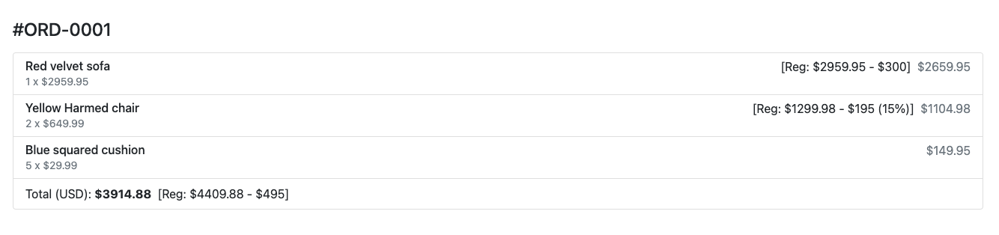

# This is the front-end code challenge from QuoteMachine.

[QuoteMachine Technical Test](https://bitbucket.org/atelier35/golang-react-test/src/master/)

## Contents

- [Demo](#demo)
- [Installation](#installation)
- [Unit Test Cases](#unit-test-cases)
- [Tech Stack](#tech-stack)
- [Future improvement](#future-improvement)

## Demo

## Installation

> This project was bootstrapped with [Create React App](https://github.com/facebook/create-react-app).

1. Clone this project

`$ git clone git@github.com:christy313/QuoteMachine-fecc.git`

2. cd into project directory

`$ cd QuoteMachine-fecc`

3. Install all npm packages

`$ npm install`

4. Run npm development script

`$ npm start`

5. Browse to [http://localhost:3000](http://localhost:3000) to view

## Unit Test Cases

- Run following command at root directory

`$ npm run test`

## Tech Stack

- HTML
- CSS
- Javascript
- React class component
- Jest
- ESlint
- Prettier

## Future improvement

- Use vite instead of create react app
